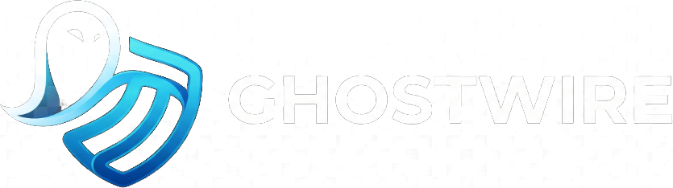

<div align="center">

  

  <p align="center">
    <strong>Zero-Knowledge, End-to-End Encrypted Peer-to-Peer Messaging Platform</strong>
  </p>

  <p align="center">
    <a href="https://ghostwire-ugfs.onrender.com"></a>
    <a href="#features"></a>
    <a href="#tech-stack"></a>
    <a href="#license"></a>
  </p>

</div>

---

## ⚡ Overview

**GhostWire** is a modern, high-performance, browser-native end-to-end encrypted messaging application. Powered by standard WebCrypto APIs (`ECDH` key agreement with `AES-256-GCM` encryption), GhostWire ensures that all messages, attachments, and voice notes are encrypted directly on the client before being relayed over real-time WebSockets. The server acts strictly as a blind relay and has zero visibility into plaintext content.

GhostWire includes an isolated, real-time **Moderator Operations Console** protected by cryptographically hashed Master Key authentication.

---

## 🚀 Key Features

### 🔒 Cryptography & Messaging
- **True End-to-End Encryption (E2EE)**: Direct client-to-client cryptographic sessions established with ephemeral `P-256` ECDH prekeys and 256-bit AES-GCM ciphers.
- **Client-Side Media & Voice Notes**: Voice recordings, images, and attachments are encrypted in memory before transmission.
- **Real-Time Communication**: Sub-millisecond bidirectional messaging, live typing status, and presence tracking over persistent WebSockets.
- **Zero-Knowledge Backend**: Messages stored in transit are completely encrypted with authenticated GCM tags.

### 🛡️ Live Moderator Operations Suite (`/moderator`)
- **Single-Master Moderator Architecture**: Zero user promotion loopholes—the console is unlocked strictly via encrypted Master Moderator Key validation.
- **Cryptographic Key Hashing**: Key verified using **PBKDF2-HMAC-SHA256** (200,000 iterations + dedicated salt). Zero plaintext storage.
- **Live User Directory & Inspection**: Filter users (`Online`, `Offline`, `Banned`), inspect room associations, message volume, and last-seen activity timestamps.
- **Instant Moderation Controls**:
  - ⚡ **Kick**: Terminate active WebSockets and invalidate sessions in real time.
  - 🚫 **Ban / Unban**: Platform suspension with custom reasons and automatic session revocation.
  - 🗑️ **Permanent Cascade Delete**: Irreversibly wipe user credentials, prekey bundles, conversation rooms, and messages.
- **System-Wide Announcements**: Push real-time broadcast banners across all connected client WebSockets.
- **Audit Logs & Export**: Full chronological activity ledger and 1-click JSON report export.

---

## 🛠️ Tech Stack

| Layer | Technologies |
|---|---|
| **Frontend** | Vanilla HTML5 / ES6 JavaScript, WebCrypto API, TailwindCSS, Glassmorphic UI |
| **Backend** | Python 3.11+, FastAPI, Uvicorn, WebSockets |
| **Database & ORM** | SQLite / aiosqlite, SQLAlchemy 2.0, SQLModel |
| **Security & Auth** | PBKDF2-HMAC-SHA256, WebAuthn Passkeys, Constant-Time Digest Verification |

---

## 💻 Quick Start (Local Development)

### 1. Clone the Repository
```bash
git clone https://github.com/your-username/ghostwire.git
cd ghostwire
```

### 2. Install Dependencies
```bash
pip install -r requirements.txt
```

### 3. Start the Application
```bash
python run.py
```
*Or launch directly with Uvicorn:*
```bash
uvicorn server:app --host 0.0.0.0 --port 8000 --reload
```

### 4. Access the Application
- **💬 Chat Portal**: [http://localhost:8000](http://localhost:8000)
- **🛡️ Moderator Console**: [http://localhost:8000/moderator](http://localhost:8000/moderator)

---

## 📄 License

Distributed under the **MIT License**.
